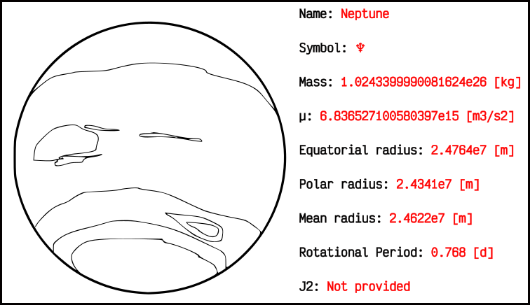

Bodies module
=============

This module contains different classes that will help user to use solar
system bodies or just create custom ones.

Following images try to collect main information provided by poliastro from
a graphic point of view. At the end of this page, you can find more information
on the tools provided by the `poliastro.bodies` module.

.. automodule:: poliastro.bodies
    :members:

