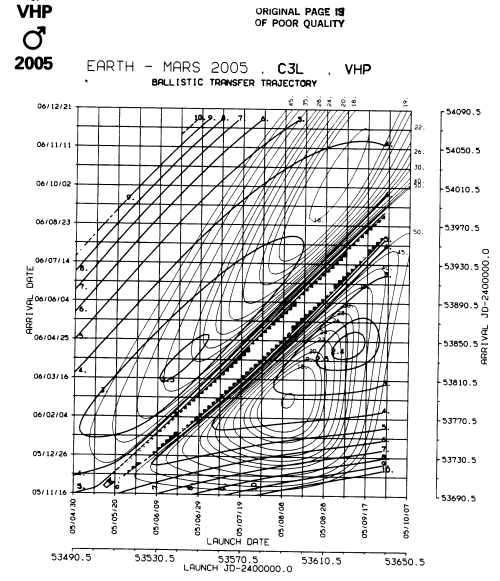

.. note::
    :class: sphx-glr-download-link-note

    Click :ref:`here <sphx_glr_download_auto_examples_plot_porkchops_with_poliastro.py>` to download the full example code
.. rst-class:: sphx-glr-example-title

.. _sphx_glr_auto_examples_plot_porkchops_with_poliastro.py:

Porkchops with poliastro
------------------------

Porkchops are also known as mission design curves since they show
different parameters used to design the ballistic trajectories for the
targetting problem such us:

-  Time of flight (TFL)
-  Launch energy (C3L)
-  Arrival velocity (VHP)

For the moment, poliastro is only capable of creating these mission
plots between ``poliastro.bodies`` objects. However, it is intended for
future versions to make it able for plotting porkchops between NEOs
also.

Basic modules
~~~~~~~~~~~~~

For creating a porkchop plot with poliastro, we need to import the
``porkchop`` function from the ``poliastro.plotting.porkchop`` module.
Also, two ``poliastro.bodies`` are necessary for computing the
targetting problem associated. Finally by making use of ``time_range``,
a very useful function available at ``poliastro.utils`` it is possible
to define a span of launching and arrival dates for the problem.

.. code-block:: default

    import astropy.units as u
    import matplotlib.pyplot as plt
    from poliastro.bodies import Earth, Mars
    from poliastro.plotting.porkchop import porkchop
    from poliastro.util import time_range

    launch_span = time_range("2005-04-30", end="2005-10-07")
    arrival_span = time_range("2005-11-16", end="2006-12-21")

Plot that porkchop!
~~~~~~~~~~~~~~~~~~~

All that we must do is pass the two bodies, the two time spans and some
extra plotting parameters realted to different information along the
figure such us:

-  If we want poliastro to plot time of flight lines: ``tfl=True/False``
-  If we want poliastro to plot arrival velocity: ``vhp=True/False``
-  The maximum value for C3 to be ploted:
   ``max_c3=45 * u.km**2 / u.s**2`` (by default)

.. code-block:: default

    # We create the porkchop
    dv_dpt, dv_arr, c3dpt, c3arr, tof = porkchop(Earth, Mars, launch_span, arrival_span)
    plt.show()

.. image:: /auto_examples/images/sphx_glr_plot_porkchops_with_poliastro_001.png
    :class: sphx-glr-single-img

.. rst-class:: sphx-glr-script-out

 Out:

 .. code-block:: none

    /home/lobo/Git/poliastro/docs/source/examples/plot_porkchops_with_poliastro.py:59: UserWarning:

    Matplotlib is currently using agg, which is a non-GUI backend, so cannot show the figure.

NASA's same porkchop
~~~~~~~~~~~~~~~~~~~~

We can compare previous porkchop with the ones made by NASA for those
years.

   Porkchop to Mars

.. rst-class:: sphx-glr-timing

   **Total running time of the script:** ( 0 minutes  20.268 seconds)

.. _sphx_glr_download_auto_examples_plot_porkchops_with_poliastro.py:

.. only :: html

 .. container:: sphx-glr-footer
    :class: sphx-glr-footer-example

  .. container:: sphx-glr-download

     :download:`Download Python source code: plot_porkchops_with_poliastro.py <plot_porkchops_with_poliastro.py>`

  .. container:: sphx-glr-download

     :download:`Download Jupyter notebook: plot_porkchops_with_poliastro.ipynb <plot_porkchops_with_poliastro.ipynb>`

.. only:: html

 .. rst-class:: sphx-glr-signature

    `Gallery generated by Sphinx-Gallery <https://sphinx-gallery.github.io>`_
